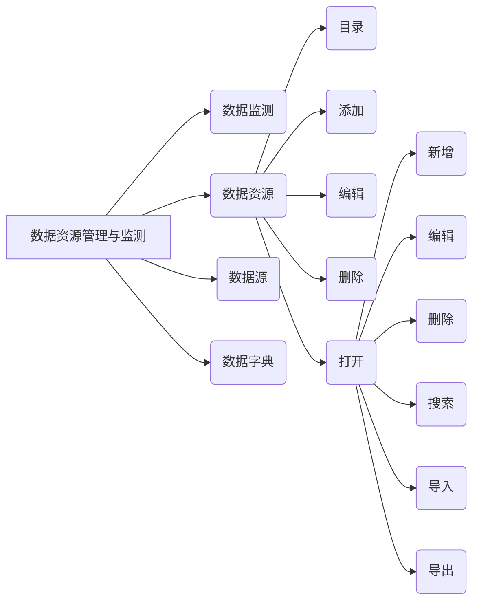

```mermaid
graph LR
A[数据资源管理与监测]
A --> B(数据监测)
A --> C(数据资源)
A --> D(数据源)
A --> E(数据字典)
C --> C1(目录)
C --> C2(添加)
C --> C3(编辑)
C --> C4(删除)
C --> C5(打开)
C5 --> C51(新增)
C5 --> C52(编辑)
C5 --> C53(删除)
C5 --> C54(搜索)
C5 --> C55(导入)
C5 --> C56(导出)
```
